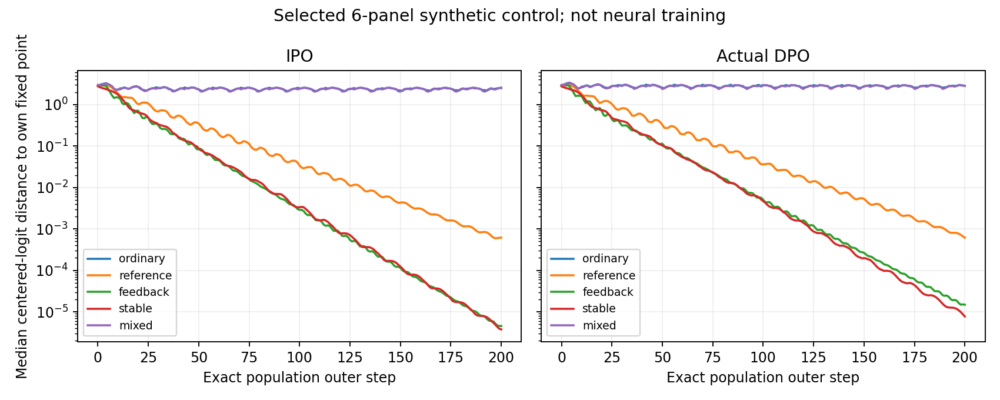

# Calibrated cyclic mechanism micropilot (2026-09-28)

Status: **prepared and CPU-calibrated; NOT approved or submitted for GPU training**.
The running v1 pilot and its immutable server sources/results are unchanged.
The source and the dated calibration are on the `hodge-diagnostics` branch.

This is a deliberately selected **six-prompt mechanism diagnostic**, not a
replacement for a representative 500-prompt study or evidence of neural
stabilization. It uses one training seed, 0. No five-seed campaign is scheduled.

## Why the original six runs are not enough

The original hard tournament mixes directional and cyclic effects. The reported
IPO population index .863 does not apply to actual DPO. At the original point
(.9, .8, 1), a uniform panel reference gives ordinary radii .929 for IPO and
1.289 for actual DPO. The current .45 reference and .25 feedback coefficients
do not stabilize that illustrative DPO point. Initial Qwen reference scores
are usually strongly concentrated and cannot be replaced by a uniform reference.

The new code differentiates the actual weighted BT optimum, checks its root
against the training population target, and computes augmented history spectra.
For arbitrary cyclic P, it does not substitute elementwise logit(P), assume
general DPO root uniqueness, or interpret a failed solve as stability.

## Frozen environment and support selection

- Same initial Qwen2.5-1.5B, sequence sums including EOS, no token averages.
- The raw sampler remains `mu=.2*uniform+.8*softmax(sequence_sum)`.
  Relative-to-initial entropy is logged separately; it is not the sampler.
- Source: cached initial scores from the existing 500-panel pilot, with input
  hashes in `calibration/2026-09-28/calibration_report.json`.
- Only 8/500 panels have all four initial raw probabilities >= .005. Of those,
  6 pass the same positive/negative local predictions for BOTH objectives and
  BOTH cycle orientations. IDs: **54, 251, 612, 737, 867, 945**.
- This is explicit theory-guided support selection, not random representative
  sampling. The eligible-but-rejected panels are retained in the audit report.
- CPU exploration considered IPO beta_train=.08/.1/.12/.15/.2/.25/.3 and DPO
  .32/.4/.48/.6/.8/1/1.2 with alpha=.9, lambda=.8, nu=.45, kappa=.5.
  The selected point was chosen before any new neural training outcomes.
- Roles are fixed by ascending response token length, then initial sequence
  score, then source index to break ties. Ties and short responses limit the
  strength of the semantic interpretation; no response text is reordered.

The soft oracle is a four-cycle over those fixed roles: adjacent forward
preferences .8, reverse .2, opposite pairs .5, diagonal .5. Thus
`(P-.5) 1 = 0`: its directional component is zero. There is no scalar reward
model and no learned preference model in this synthetic oracle.

The mixed arm reverses the cycle on three of the six prompts using seed 123.
It preserves the text, initial scores, role assignment, zero directional
component, and per-panel cyclic norm. With nonuniform references the exact
fixed points/gains need not be identical; both orientations were calibrated.
Call the arms **role-aligned/mixed**, not proven neural coherent/incoherent.
Actual LoRA feature coherence has not been measured.

## Ten prepared arms, run in stages after approval

All arms: alpha=.9, lambda_current=.8, training seed=0, same six panels.

| Stage | Arm per objective | IPO beta_train | DPO beta_train | nu | kappa | Purpose |
|---|---|---:|---:|---:|---:|---|
| A | ordinary | .2 | .8 | 0 | 0 | Population-unstable positive control |
| A | stable | .4 | 1.6 | 0 | 0 | Ordinary stable negative control |
| B | reference | .2 | .8 | .45 | 0 | Same-beta lagged-reference intervention |
| B | feedback | .2 | .8 | 0 | .5 | Same-beta oracle-assisted feedback extrapolation |
| C | mixed | .2 | .8 | 0 | 0 | Role-orientation sensitivity control |

Stage A is four runs; Stage B adds four only if Stage A is informative; Stage C
adds two. A lack of neural oscillation must not trigger an automatic full sweep.
All ten configurations are prepared for reproducibility, **not blanket approval
to launch all ten**. Each needs one GPU; inspect all running and pending account
jobs first. Follow the active `AGENTS.md` phase budget and
[scheduling rules](../../docs/SCHEDULING.md); this release does not increase
that budget. Do not cancel existing work or allocate GPUs to wait for another
task inside a script.

The negative control changes beta and generally has a different fixed point.
Only the ordinary/reference/feedback contrast at the SAME beta shares the
population fixed-point equation. No equal-endpoint claim is made for finite
LoRA optimization.

## Actual measured local predictions

Radii use measured initial Qwen scores, not an assumed uniform reference.
Local gates are ordinary >=1.03 and the intended stable arm <=.98 on every
selected panel. Values below refer to the role-aligned arms.

| Objective | Ordinary | Reference | Feedback extrapolation | Stable ordinary |
|---|---|---|---|---|
| IPO | 1.047--1.078 | .956--.962 | .920--.955 | .932--.946 |
| Actual DPO | 1.050--1.079 | .957--.962 | .923--.957 | .937--.947 |

Exact population updates from each actual initial reference were also run for
200 steps. Ordinary endpoint distances from their fixed points remain above
2 nats in centered-logit Euclidean norm, while both interventions are below
.001 on all six panels. This is a numerical actual-start check, not a global
convergence theorem or a neural result; it does not prove a periodic orbit.



## What the feedback arm does and does not test

`run_oracle_feedback_extrapolation.py` is the explicit new entry point.
It computes full-P optimal feedback `d(mu)` and trains a positive pairwise
loss against reference `r + kappa*(d(mu_t)-d(mu_prev))`. The unconstrained
target is `r + (1+kappa)*d(mu_t)-kappa*d(mu_prev)`.

For IPO, d is the linear identity payoff. For DPO, d is the actual BT optimum
divided by beta_train. This implementation is **not the manuscript's signed
two-sampler loss**. No gradient, variance, practical oracle-access, or data
efficiency equivalence to that estimator is claimed. Direct testing of that
estimator remains a separate protocol decision with Fan; it has not been
silently implemented or advertised as validated here.

## Neural training budget and diagnostics

- 30 outer rounds per arm, not 30 optimizer updates. No automatic continuation.
- All six unordered pairs per prompt, soft expected labels, positive `6*w_ij`
  weighting exactly once. Complete pair enumeration removes pair-selection
  Monte Carlo noise; minibatch optimizer effects and model bias remain.
- 10 epochs over the 36 pairs each round, batch1, accumulation4: **90 optimizer
  updates/round, 2,700/run**. Same budget for every arm, including controls.
- AdamW LR1e-5, warmup.03, reset each outer round; LoRA r16/alpha32/dropout0;
  BF16 with the cuDNN-SDPA exclusion, gradient clipping1; max_length1537.
- Fresh initial sequence scores and EOS/token lengths must match the frozen
  calibration before the first optimizer update. A mismatch fails closed.
- The runner writes fixed-point residuals, centered step size, cyclic-mode
  real/imaginary coordinates, amplitude and phase, raw panel entropy, relative
  entropy, panel mass, and the actual population-target error at every step.
- `operator_residual` is a combination of optimizer error, finite inner budget,
  and representation bias. In the old sampled-pair protocol it additionally
  includes comparison sampling noise; it is not pure optimizer noise.

Interpretation gate: require persistent mode amplitude/phase progression in
ordinary beyond the stable control's transient, and attenuation toward the
same-beta population fixed point under an intervention. Entropy alone is
insufficient. If ordinary is also neural-stable or the target error dominates,
report that failure to transfer the population mechanism and diagnose the
inner budget/shared representation before scaling up. No held-out quality or
open-generation improvement claim is available from these six panels.

Wall time is not yet measured for this new support/budget. Do not reuse the
old 500-panel throughput as a reliable estimate. Time Stage A first.

## Reproduction and guarded execution

The checked-in plan contains IDs/numeric scores/hashes, not raw dataset text.
Exact CPU replay is self-contained and needs no checkpoint or server access:

```bash
python experiments/cyclic_history/replay_calibration.py \
  --plan experiments/cyclic_history/calibration/2026-09-28/experiment_plan.json \
  --out outputs/calibration_replay
```

To reproduce support selection from the original private/local artifacts:

```bash
python experiments/cyclic_history/prepare_calibrated_plan.py \
  --snapshot PATH/step_0000.npz --support PATH/support.json \
  --manifest PATH/manifest.json --out outputs/new_calibration --min-panels 6
```

Raising `--min-panels` to e.g.32 blocks this source pool and emits no runnable
plan. A broader study first needs more distinct, suitable prompt/response panels
and new initial scoring/calibration; do not duplicate six prompts to meet a
sample-size gate or silently switch to a relative sampler.

Read-only server/source validation:

```bash
python experiments/cyclic_history/run_cyclic_history.py \
  --plan experiments/cyclic_history/calibration/2026-09-28/experiment_plan.json \
  --run-id ipo_ordinary_calibrated_s0 --check-data
```

Training additionally requires `--execute --approve-calibrated-micropilot`, an
explicitly approved Slurm allocation and exactly one visible GPU. Parameter,
panel, role, tokenization, score, or prediction-gate drift is rejected. The
old v1 training entry now requires `--allow-uncalibrated-legacy`; immutable
already-running server copies are unaffected. No new launcher auto-submits,
auto-requeues, resumes, or overwrites a run directory.

`slurm/cyclic_history_calibrated.sh` selects only the explicitly approved stage:

```bash
# Examples only: first reconcile the active phase, all allocations and pending
# jobs; set scheduler dependencies if needed. Never submit these blindly.
APPROVED_CALIBRATED_STAGE=A sbatch --array=0-3%2 slurm/cyclic_history_calibrated.sh A
# Only after inspecting Stage A outcomes and separately approving Stage B:
APPROVED_CALIBRATED_STAGE=B sbatch --array=0-3%2 slurm/cyclic_history_calibrated.sh B
# Only after separately approving the orientation control:
APPROVED_CALIBRATED_STAGE=C sbatch --array=0-1%2 slurm/cyclic_history_calibrated.sh C
```

These are separate arrays with independent throttles, not an account-wide cap.
Do not submit all stages together. Stage B is an evidence-dependent decision,
not an automatically satisfied Slurm dependency. Each task receives one GPU;
the template validates its stage, index, and explicit approval before training.
