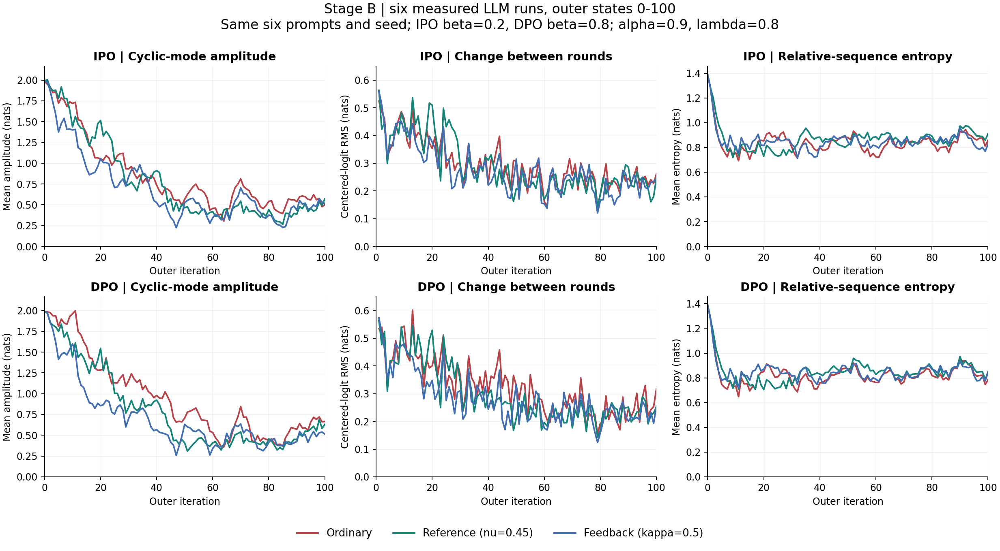

# Executed cyclic LLM campaigns: September 29, 2026

This is the execution record, separate from the collaborator's preserved
[two-week roadmap](../../hodge_diagnostics/plans/2026-09-29-two-week-experiment-plan.md).
The roadmap's broader experiments remain proposals, not approved submissions.
The user chose empirical relative phenomena rather than making precise neural
fixed-point fitting a prerequisite for running B/C.

## Status and scope

September 29 follow-up: the user approved exactly two empirical reference
arms with `r_t=.1*s_t+.9*s_{t-1}` (alpha=1, nu=.9), 100 updates, IPO beta=.2
and DPO beta=.8. See [reference90 protocol](cyclic_history_reference90_20260929/README.md)
and its submission receipt for launch status. This is separate from A/B/C
and does not authorize the two-week roadmap. The A/B/C source remains f0fe034;
the new deployment records its own commit and retains support/initialization
validation without importing the old alpha<1 fixed-point predictions.

| Campaign | Array | Arms | Recorded horizon | Verified status |
|---|---|---|---|---|
| Stage A | 4603433 | IPO ordinary/stable; DPO ordinary/stable | outer 0..30 | All four completed |
| Fixed-target probes | 4605171 | Same four methods/betas, frozen outer-20 target | 6 blocks, cumulative 10..60 inner epochs; no outer update | All four completed |
| Stage B100 | 4605560 | IPO/DPO each ordinary, reference, feedback | outer 0..100 | All six completed; 606 finite snapshots |
| Stage C100 | 4606367 | IPO/DPO mixed orientation, ordinary update | outer 0..100 | Both completed, exit 0:0; verified September 29 at 13:44 UTC |

These are timestamped records, not a live dashboard. Never duplicate these
jobs. Current GPU allocations must be rechecked from the full owner/UID queue.
Stage B ran for 2:17:05--2:19:56 per arm on one H100 each. Stage C elapsed
times were 2:17:06 and 2:17:53. The latest full account check was empty (0 GPUs).

All use alpha=.9, lambda_current=.8, seed0 and the same six selected prompts
(54, 251, 612, 737, 867, 945), four fixed responses per prompt. Main ordinary
and history arms use IPO beta_train=.2 and DPO beta_train=.8. A's stable
controls instead use .4 and 1.6. B's reference has nu=.45, feedback kappa=.5.
C reverses the cycle for prompts 54/612/867 only (preselected orientation
[-1,+1,-1,+1,-1,+1]), keeping ordinary updates and all other training settings.

The source used for neural training was frozen at **f0fe034**. Core training
code has not changed in this publication. The fixed-target runner is now also
tracked; each probe manifest records its own source hashes. GitHub publication
does not modify running jobs or their deployed copies.

## Findings, with limits

- [Stage A report](cyclic_history_stage_a_analysis_20260928/REPORT.md): exact
  population predictions did not cleanly transfer to neural dynamics. Inner
  target-fit error remained material.
- [Fixed-target probes](cyclic_fixed_target_launch_20260928/README.md): more
  repeated-reset inner training did not solve target fitting. This is not an
  isolated diagnosis of learning rate, capacity or optimizer reset.
- [Stage B report](cyclic_history_stage_b100_results_20260929/REPORT.md): over
  states 51..100, reference/feedback reduced mean cyclic-mode amplitude by
  25.5%/20.0% for IPO and 22.8%/18.9% for DPO. Each comparison improved 5/6
  prompts, with reported exceptions. Ordinary also contracted strongly and
  all arms retained late motion: no clean divergent-versus-converged claim.
- [Stage C report](cyclic_history_stage_c100_results_20260929/REPORT.md): mixed
  orientations increased late probability motion, rather than cancelling it.
  Mean TV rose 20.9% (IPO) / 31.0% (DPO), with increases in 5/6 prompts.
  One seed does not establish a universal effect or gradient mechanism.

This is a one-seed, selected-six-prompt mechanism study, not a representative
quality evaluation or significance claim. Feedback uses full-P optimal feedback
extrapolation, **not** the manuscript's signed two-sampler loss. No winning rate
or open-generation-collapse measurement was collected here.

## Figures and quantities

[Stage C complete figure pack](cyclic_history_stage_c100_results_20260929/all_stage_c_figures.pdf)
includes all-prompt aligned/mixed pi comparisons, common probability-plane
trajectories, relative entropy, TV, and an eight-arm B/C overview. Mixed
orientation has its own theoretical origin/mode; common-plane comparisons
instead use the same fixed probability contrasts. See the report for definitions.

[All six pi plots, one PDF](cyclic_history_stage_b100_results_20260929/pi_curves/stage_b_all_pi_curves.pdf)
show four response probabilities for each of the six prompts, separately for
IPO/DPO ordinary/reference/feedback. Colors identify response index, not method.



- `pi_panel = softmax(s_t)`, response-token **sequence sums including EOS**:
  conditional probability on the four fixed responses, not full response-space
  probability and not the sampling mixture `.2*uniform+.8*pi_panel`.
- Relative-sequence entropy is `H(softmax(s_t-s_0))`; it starts at log(4) by
  construction. It is not raw panel entropy or token-average entropy.
- Mode plots use a calibrated complex projection of measured centered logits.
  The fixed point defines the origin; curves are actual LLM measurements,
  not theoretical rollouts. A small 2D projection is not full convergence.
- Every prompt is retained. No smoothing/interpolation or invented step-100
  endpoints. Phase near zero amplitude is sensitive and marked explicitly.

## Portable configurations and safe previews

From the repository root (Python 3.12 and `requirements.txt`):

```bash
python experiments/cyclic_history/run_cyclic_history.py \
  --plan experiments/cyclic_history/plans/stage_b100.json --run-id ipo_ordinary_b100_s0
python experiments/cyclic_history/run_cyclic_history.py \
  --plan experiments/cyclic_history/plans/stage_c100.json --run-id dpo_mixed_c100_s0
```

These are preview-only and never submit or train. The checked-in portable
plans have exactly the executed mathematical contracts, but repository-relative
model/data/output paths. Generate a relocated plan without training:

```bash
python experiments/cyclic_history/make_100_round_plan.py --stage C \
  --model-path /path/to/model --eval-path /path/to/panels.jsonl \
  --output-root /path/to/new-results --output /path/to/new-plan.json
```

Fresh training requires separate approval, a Slurm GPU, `--execute` and
`--approve-calibrated-micropilot`. Plans/outputs are not overwritten. Existing
campaigns must not be resubmitted. No extra seeds or sweeps are implied.

## Replot public tables (no private data or model needed)

```bash
python experiments/cyclic_history/campaigns/cyclic_history_stage_b100_results_20260929/plot_pi_curves.py \
  --table experiments/cyclic_history/campaigns/cyclic_history_stage_b100_results_20260929/pi_curves/pi_trajectories.csv \
  --output-dir outputs/stage_b_public_pi
```

This checks completeness, finite probabilities, unit sums, shared initial pi
and reconstruction from the exported sequence sums, then produces all six
PNG/PDF plots and a combined PDF. It does not claim to re-verify private raw
file hashes. Public CSV files contain numeric coordinates/probabilities and
prompt IDs only, never prompt or response text.

## Full private-data audit

The original local download layout is preserved: `raw/<run>/` holds manifest,
metrics, support, tokenization audit, predictions and snapshots, with the
download receipt alongside it. Stage B's receipt also covers original logs.
With these authorized private downloads available:

```bash
python experiments/cyclic_history/campaigns/cyclic_history_stage_b100_results_20260929/analyze_stage_b.py \
  --results-dir /path/to/cyclic_history_stage_b100_results_20260929 --output-dir outputs/stage_b_audit
python experiments/cyclic_history/campaigns/cyclic_history_stage_a_analysis_20260928/analyze_stage_a.py \
  --results-dir /path/to/cyclic_history_stage_a_analysis_20260928 --output-dir outputs/stage_a_audit
python experiments/cyclic_history/campaigns/cyclic_fixed_target_results_20260928/check_results.py \
  --results-dir /path/to/cyclic_fixed_target_results_20260928 \
  --stage-a-results-dir /path/to/cyclic_history_stage_a_analysis_20260928 --output-dir outputs/fixed_target_audit
```

The audits verify source hashes and recompute numerical quantities, including
the saved mode basis. New source that changes those definitions should fail
these checks rather than silently relabeling historical results. Stage B's
published late window requires all runs complete to 100. The optional
`plot_pi_curves.py --include-text` is private-use only and is never needed to
reproduce public plots. Read-only `fetch_results.py` tools require Paramiko,
an authorized Sycamore account/VPN, strict known_hosts validation, and a password
supplied through `SYCAMORE_PASSWORD`, never saved in code. These tools target
the recorded cluster deployment; they are not generic dataset downloaders.

## Archived launch tools and publication boundary

Each `*_launch_*` directory includes its original cluster plan, guarded
submission/inspection scripts, deployment hashes and submission receipt.
They contain historical machine paths and job IDs. They are records, not a
request to execute old sbatch commands. Source tarballs can be reconstructed
from the recorded Git revision for A/B/C (the B/C archive was `git archive
f0fe034`); tarballs and unpacked duplicate checkouts are not committed.
`build_plan.py` import paths are adapted to the repository layout; use the
portable plan exporter above for fresh configs. The fixed-target source
archive included the then-uncommitted probe runner now published here.
Original deployment hashes refer to original deployed bytes, not to reformatted
GitHub packaging. Portable plan provenance hashes canonical JSON values so
Windows/Linux line endings do not change the mathematical identity.

Private raw text, NPZ dumps, adapters/checkpoints, model weights, credentials,
full queue snapshots and execution logs are excluded. The reports' references
to these files describe the retained local/server artifacts, not GitHub files.
Older reports' suggested gates/statuses are historical; this index gives the
later approved progression. CPU-only checks never allocate a GPU. Publishing
or testing this release does not submit, cancel or modify any experiment.
