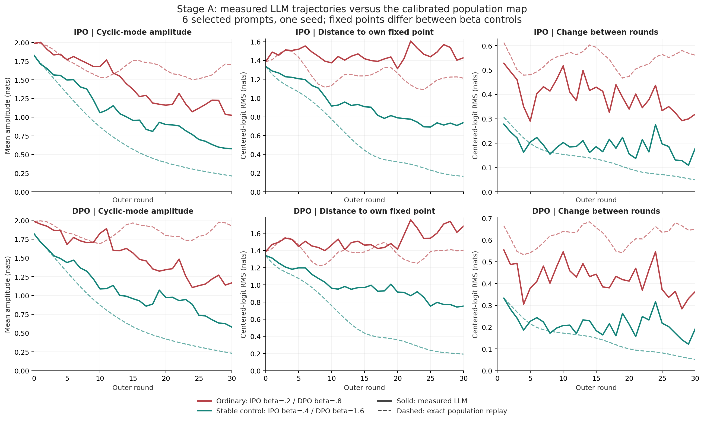
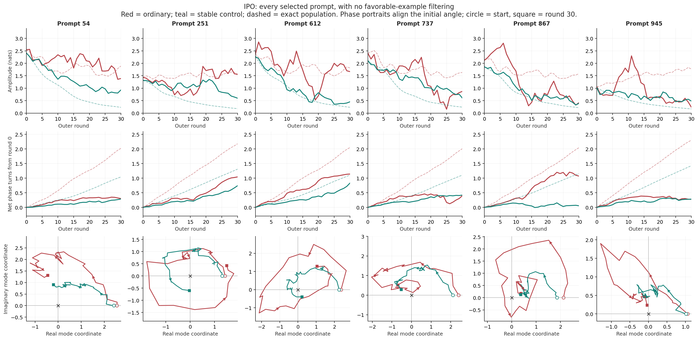
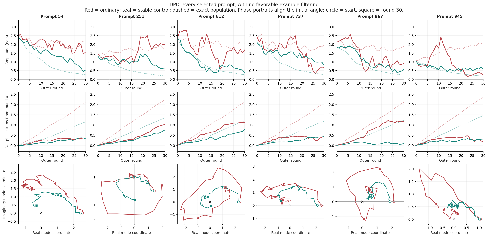
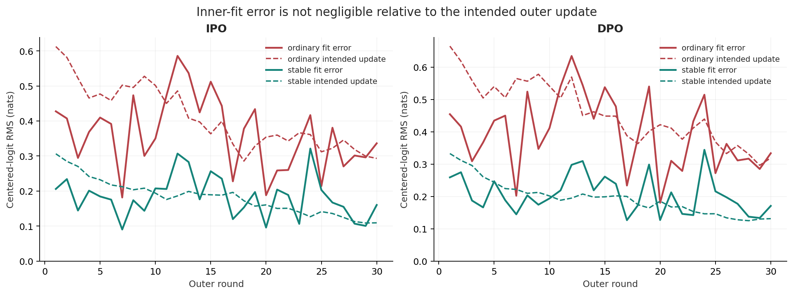

# Stage A 循环轨迹与稳定对照分析

归档说明：以下为 Stage A 完成时的分析和建议。此后用户已批准并完成 Stage B，Stage C 也已提交；最新状态见[实验索引](../README.md)。本文的历史建议不应被当作当前任务授权。

日期：2026-09-28。对象：校准后的六 prompt cyclic-history micropilot，Slurm array 4603433，四组均完成 30 个 outer rounds。本文只分析已有结果并提出下一步建议，没有提交、取消或修改服务器实验。

## 1. 结论

**第一阶段有信息量，但没有完整通过“普通组持续循环、稳定组收敛”的验证门槛。**

- IPO 与 DPO 的 ordinary 组均在部分 prompt 上表现出较清楚的旋转轨迹；提高 beta 的对照组平均振幅和步间变化更小。
- 不能把这些轨迹称为已经验证的持续极限环：只观察了 30 轮，ordinary 组平均振幅也在下降，不同 prompt 的行为差异很大。
- “stable” 是预先根据 population map 选择的配置名称，不等于 LLM 已经收敛。实际稳定对照仍明显偏离其各自的理论固定点。
- 每轮 LLM 拟合后的目标误差，与理论要求的单步更新同量级。因此目前不能把全部偏差归因于论文中的 population dynamics，也不能认定某一种优化器问题已经被定位。
- 建议先做四组廉价的**固定单轮目标拟合探针**，再决定 Stage B。暂不直接扩大到 500 prompts、更多参数或 mixed-orientation Stage C。

## 2. 实验口径

所有组共同使用 alpha=.9、lambda_current=.8、seed=0，以及 prompt IDs 54、251、612、737、867、945。这六个 prompt 是训练前按校准条件筛选的机制诊断集，不是代表性随机样本；同一模型同时拟合它们，不能当成六个独立 seed。

偏好为固定四环 soft preference：正向 .8、反向 .2、对边 .5，没有 scalar reward model。采样器保持 `.2*uniform + .8*softmax(sequence_sum)`；relative entropy 只是诊断，不参与采样。

| 方法 | Ordinary | Stable control | 历史项 |
|---|---:|---:|---|
| IPO | beta=.2 | beta=.4 | nu=0, kappa=0 |
| DPO | beta=.8 | beta=1.6 | nu=0, kappa=0 |

每轮枚举每个 prompt 的六个 unordered pairs，使用 soft expected labels，10 epochs、90 optimizer updates；每组共 2,700 updates。各轮重置 AdamW，LR=1e-5，按该轮总步数线性 warmup/decay。使用共享 LoRA r=16、BF16、sequence-sum（含 EOS）。

**两个 beta 对照通常具有不同固定点。** 下文距离都相对于该组自己的固定点。Stage A 不是“保持 beta 不变，只改变历史项”的因果对照。

## 3. 总体数值

窗口固定为状态/轮次 21--30。振幅取时间和 prompt 的均值；其他 RMS 在时间、prompt 和四维 centered logits 上合并计算。以下是描述性统计，无置信区间或显著性推断。

| 方法/组 | 后期循环模态振幅 | 到自身固定点 RMS | 步间变化 RMS | 单轮目标拟合误差 RMS | 理论单步更新 RMS |
|---|---:|---:|---:|---:|---:|
| IPO ordinary | 1.1544 | 1.4915 | .3506 | .3125 | .3330 |
| IPO stable | .7133 | .7315 | .1782 | .1821 | .1308 |
| DPO ordinary | 1.2287 | 1.6448 | .3969 | .3495 | .3672 |
| DPO stable | .7721 | .8167 | .2074 | .1969 | .1437 |

相对于 ordinary，stable 的后期平均模态振幅降低约 38.2%（IPO）/37.2%（DPO），步间变化降低约 49.2%/47.7%。这支持“对照更平稳”，但不单独证明收敛。

第 30 轮稳定对照的固定点距离：

| 方法 | 实际 LLM RMS | 同初始条件 exact population replay RMS |
|---|---:|---:|
| IPO stable | .7383 | .1653 |
| DPO stable | .7521 | .1927 |

实际 LLM 与精确更新已有明显量级差异。同时 ordinary 平均振幅从中期到后期也在下降：IPO 1.3819 -> 1.1544，DPO 1.5242 -> 1.2287。不能只截取某段回升就声称已达到稳定周期轨道。



## 4. 逐 prompt 结果

下表为 ordinary 组从 round 0 到 30 的展开相位净转数。它测量在预先校准的复模态平面中的旋转，不是完整高维状态回归次数。

| Prompt | IPO 净转数 | DPO 净转数 | 观察 |
|---|---:|---:|---|
| 54 | .303 | .306 | 后期停转/小范围往返，仍远离固定点 |
| 251 | 1.044 | 1.031 | 旋转最清楚，最后十轮仍前进约 .556/.533 圈 |
| 612 | 1.142 | 1.119 | 转过一圈，后期振幅回升，最后十轮仍前进约 .229/.197 圈 |
| 737 | .398 | .461 | 振幅明显衰减，轨迹不支持持续转动 |
| 867 | 1.071 | 1.160 | 总计转过一圈，但后期转速下降、方向更不规则 |
| 945 | .276 | .151 | 后期振幅较小，主要表现为衰减和往返 |

两种方法都是 3/6 prompt 净转数超过一圈，但 251、612 的后期持续旋转证据更清楚。两种方法也都只有 4/6 prompt 的后期 ordinary 振幅大于对应 stable，737 和 945 是反例。

**转过一圈本身不是不稳定判据。** Exact stable 轨迹也会一边旋转一边衰减；它们在 30 轮内甚至可以比部分实际 ordinary 轨迹转得更多。必须联合看振幅、相位、固定点距离和足够长的观察窗口。

完整六 prompt 都展示在下列图中，没有只保留有利示例。相图以各组自己的固定点为原点，并旋转坐标使初始角度为零；这种展示不能用于声称不同 beta 到达同一个端点。





## 5. 最重要的偏差：LLM 没有准确实现每轮的精确更新

令 `x_t` 为四个 response 的 centered sequence-sum logits，`F(x_t)` 为该轮 unrestricted population target，则：

`x_(t+1) = F(x_t) + epsilon_t`

我们直接用保存的 target 和训练后实际分数计算 `epsilon_t`，并用同版本代码独立重算了所有 target。后期 `R = RMS(epsilon_t) / RMS(F(x_t)-x_t)` 分别为：

- IPO ordinary：.938；IPO stable：1.392。
- DPO ordinary：.952；DPO stable：1.370。

因此拟合误差不是相对理论更新可以忽略的小量。Stable 组尤其可能在目标更新变小时被拟合误差限制，但这只是待检验的解释，不是已经确认的机制。

另外拟合简单的 `actual_update = eta * intended_update` 后，相对残差仍为 .81--.94。不能把差异简单概括为“只走了约一半，所以只是有效步长变小”，也不能据此直接指定一个新 alpha 或 LR 作为修复。

可能贡献包括有限 inner budget、每轮优化日程、共享模型的跨 prompt 耦合、LoRA 可表达性和数值精度。当前记录不能单独分离这些原因；枚举 pairs 已排除 pair-selection Monte Carlo noise，但没有排除模型/优化效应。



## 6. 建议下一步：先诊断，再做历史项对照

### 6.1 第一优先：固定目标的短探针（新增，尚未实现或提交）

建议四组：IPO beta=.2/.4，DPO beta=.8/1.6，alpha=.9、lambda=.8、seed=0、nu=kappa=0 均不变。

每组从**各自已有 step_0020 adapter** 出发，先验证重新打分与保存分数一致，然后重建 round 20 -> 21 的 sampler、reference、pair weights 和 population target。固定这些对象，**不推进外层迭代**，仍共同拟合全部六个 prompt。

采用原来完全相同的 10-epoch 训练块，在同一个固定目标上做 1/3/6 块，在累计 10/30/60 epochs 时测量拟合误差。每块维持原来的 AdamW reset、90-step LR schedule、pair 顺序、batch 和 accumulation。这样不同测量预算共享完全相同的训练前缀，不会因直接扩大 epochs 而悄悄改变 warmup/decay。

诊断输出：每 prompt 的目标误差、总体误差、相对于这次固定目标的 intended-update RMS、实际与预期更新的方向一致性、非有限数和梯度记录。不能通过直接回归 target logits 替换原始 IPO/DPO pairwise loss。

判断方式：

1. 若增加训练后误差明显下降，说明有限内层拟合预算至少是一个贡献。可把 pooled R<=.25 作为后续试验的暂定工程筛选线，但它不是理论稳定阈值，也不能用 pooled 均值掩盖某个 prompt 失败。
2. 若误差停在平台，先不要继续增大 outer rounds。下一步用最小单变量对照检查共享表示，例如固定同一个失败 prompt，比“只训练该 prompt”与“仍训练六个 prompt”；额外改变 LoRA rank、精度或 LR 时须分别对照，不能同时修改。
3. 若需要更强 inner solver，后续 ordinary/control/intervention 都要使用相同新训练预算，并建立新 ordinary 基线；不能把强训练的历史项与旧的弱训练 ordinary 直接比较。旧 Stage A 结果保留。

时间估计：Stage A 实测每个 10-epoch outer round 平均 83--84 秒。六个固定目标训练块约 8--9 分钟/组，加上加载、校验和打分约预留 10--15 分钟/组，不含排队。四组可用四张 GPU；无需为用满额度而额外添加实验。提交前仍须重新核对所有账号作业和最新资源上限。

### 6.2 之后才是 Stage B：同 beta 的历史项干预

在拟合口径明确后，按已校准参数做：

| 方法 | alpha | lambda | beta | Reference arm | Feedback arm |
|---|---:|---:|---:|---|---|
| IPO | .9 | .8 | .2 | nu=.45, kappa=0 | nu=0, kappa=.5 |
| DPO | .9 | .8 | .8 | nu=.45, kappa=0 | nu=0, kappa=.5 |

这四组与各自同 beta、同 inner budget 的 ordinary 基线比较，才适合回答“历史项是否抑制同一个机制、是否趋近同一个 population fixed point”。先保持六 prompt、seed=0，不做 beta/alpha 大网格。

必须保留每轮 target-fit error。若变化主要伴随拟合质量变化，而不是理论预测的轨迹变化，就应明确报告该混杂因素。

Feedback arm 是使用 full preference matrix 的 **oracle-assisted feedback extrapolation**，不是论文 signed two-sampler loss 的直接实现；它只能支持这一 population mechanism，不直接验证后者的梯度或方差性质。

原 10-epoch 预算下，四组 30-round 运行可按约 45--60 分钟/组预留；若提高 inner budget，时间需按实际探针重新测量。只有出现可信的 paired contrast 后，再考虑同预算 ordinary/最佳干预的 60--100 轮验证，检查长程振幅和固定点距离，而不是只延长干预组。

现有 runner 不支持直接 resume 外层迭代；如需延长，应先实现并验证保留 initial reference、previous/current state 和校准信息的恢复流程，不能把新起点当成原始 reference，也不能把“已有 checkpoint”描述成已经具备无缝续跑能力。

### 6.3 暂缓 Stage C 和大规模扩展

Mixed-orientation 目前会把尚未厘清的 inner-fit / shared-representation 偏差与方向变化混在一起。先把 Stage B 的同 beta 对照做清楚，再决定是否需要它。

目前适合放进论文的是带限制说明的**机制诊断示例**和所有 prompt 的完整补充图；不适合直接写成“LLM 已证明持续循环与历史稳定化”。Stage A 尚未训练历史项，也没有测试开放生成质量或对代表性数据的泛化。

## 7. 可复现性与产物

- `raw/`：从服务器只读下载的四组原始 manifest、metrics、support、tokenization audit、population predictions 和 124 个 NPZ snapshots（31/组）。
- `download_receipt.json`：下载清单与原始文件哈希。
- `analyze_stage_a.py`：重算全部 target、200-step exact replay、指标与图。
- `summary.json`、`run_summary.csv`、`per_prompt_summary.csv`：总体和逐 prompt 数值。
- 四套同名 PNG/PDF：`stage_a_overview`、`ipo_all_prompt_trajectories`、`dpo_all_prompt_trajectories`、`stage_a_target_fit`。

校验包括：step 0--30 连续、全部 snapshot 数值有限、使用的四个本地核心源码 SHA256 与每组服务器 manifest 相符、重算 target 与保存 target 相符、重新计算的 target residual / fixed-point RMS 与 metrics 相符。Exact replay 与 neural training 使用相同实际初始分数、P 和参数。

模态定义为保存的校准左特征模态作用于 `x_t-x_star`；振幅为复坐标的模，相位按时间展开。跨 LAPACK 的特征向量常数相位歧义通过单位模相位对齐到服务器保存坐标，不改变振幅或净转数。总体固定点 RMS 不只度量该二维模态。

在本目录父级执行：

```powershell
$env:OMP_NUM_THREADS='1'
$env:OPENBLAS_NUM_THREADS='1'
python cyclic_history_stage_a_analysis_20260928/analyze_stage_a.py
```

该脚本只分析本地文件，不训练模型，不操作 Slurm，不修改原始结果。
