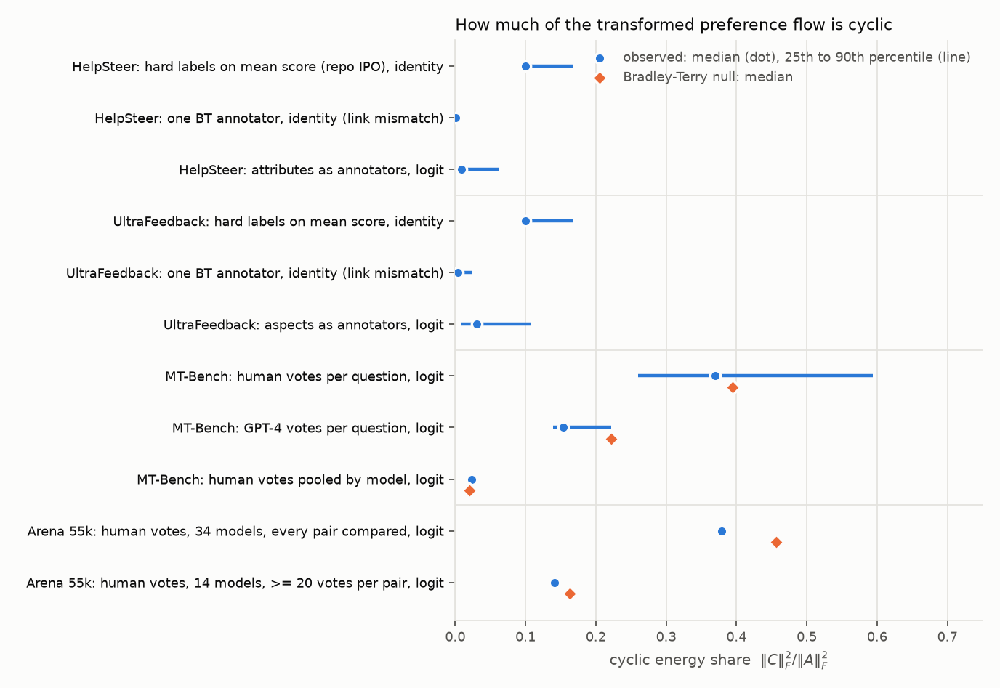
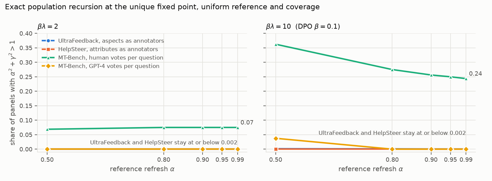

# Hodge diagnostics of public preference data for Paper B

2026-09-25. GPU-free diagnostic layer of the JMLR-B-v3 experimental roadmap (Section 7,
Part 0 item 2, with the exact-population check of A1). **Status: provisional, for
coauthor review.** These are diagnostics of preference data under stated constructions.
They are not training results, they do not verify any theorem, and they do not lift the
protocol-freeze gate on neural runs.

## Summary

1. **The mechanisms of `prop:cyclic-sources` are present in real data, and they are
   cardinal, not ordinal.** A single Bradley--Terry score gives an exactly zero residual
   under the logit link and a small positive one under the identity link. Treating rated
   attributes as annotators gives a nonzero residual under the logit link in 84% of
   HelpSteer panels and 92% of UltraFeedback panels. Condorcet cycles are almost absent:
   0 of 8,321 HelpSteer panels and 20 of 63,966 UltraFeedback panels have one.
2. **In curated multi-response datasets the residual is small.** The median cyclic energy
   share `||C||_F^2 / ||A||_F^2` is 0.9% (HelpSteer) and 3.1% (UltraFeedback), with a 90th
   percentile of 6% and 11%. The link-mismatch residual alone is smaller still: its 90th
   percentile is 0.4% and 2.3%.
3. **In human votes, the estimated residual is exactly as large as sampling noise
   predicts.** MT-Bench panels built from human votes (20 votes over 11 of 15 pairs, median)
   have a median share of 37%. A parametric bootstrap under a fitted BT truth, which has
   `C = 0` under the logit link, gives 40% (pooled p = 0.92). The same holds for model-level
   pools: MT-Bench, p = 0.62 and 0.18 for the two turns; Arena, p = 0.996 on 34 fully
   compared models and p = 0.80 on 14 models with at least 20 votes per pair. We find no
   residual that survives the noise test.
4. **At the population level, ordinary refresh almost never crosses the frontier on these
   panels.** With uniform reference and coverage, the fraction of HelpSteer and
   UltraFeedback panels with `alpha^2 + gamma^2 > 1` is at most 0.15% over
   `alpha in [0.5, 0.99]` and `beta lambda in [1, 10]`. The reason is that the directional
   part dominates: the fixed point concentrates (at `alpha = 0.9` its median entropy is
   0.09 nats for `beta lambda = 1` and 0 beyond), `J(pi*) -> 0`, and the realized gain
   vanishes. This is the "decisive prompt" regime the roadmap predicts in A2. Restricting
   to the weakest-direction decile does not change it.
5. **Frozen sampling noise does cross the frontier.** Treated as fixed matrices, the noisy
   human MT-Bench panels are beyond the frontier in 7% of cases at `beta lambda = 2` and in
   24--36% at `beta lambda = 10` (DPO `beta = 0.1`). The noisy 34-model Arena clique is
   beyond it at every `alpha` for `beta lambda = 10`. The well-estimated 14-model clique
   never is.
6. **The current neural protocol's construction adds a structural residual.** Hard labels
   on a mean score (as `scripts/build_pairs.py` orients pairs), read through the IPO
   identity link, give share 0.10 on every strictly ordered four-response panel. This
   residual comes from the 0/1 labels, not from the preferences. The same labels make the
   DPO logit targets infinite.
7. **Under parameter sharing, the per-prompt residuals largely cancel, and the part that
   survives comes from label discretization.** For a policy that shares one score per
   model or per length rank across prompts, the residuals are aligned beyond chance
   (shuffle-null p = 0.002 on every dataset). The aligned part, however, is only 10--41%
   of the per-prompt magnitude. A perfectly transitive surrogate with saturated labels
   reproduces and exceeds it on every dataset: 0.053 against 0.018 on UltraFeedback. Soft
   Bradley--Terry labels shrink it tenfold. The exact dynamics of the maximally shared
   policy converge in every configuration tested, with real and with shuffled labels.

Supporting evidence for the heterogeneity premise: in HelpSteer2, 41.6% of the 9,124
response pairs with two or more annotators have annotators on opposite sides. This is a
lower bound, because the released data exclude strongly disagreeing pairs.

## Data and constructions

| Dataset | Panels | K | Comparison graph | Constructions |
|---|---|---|---|---|
| `nvidia/HelpSteer` (train and validation) | 8,321 prompts with at least 3 distinct responses | 3 (1,617), 4 (6,692), 6--8 (12) | complete | five 0--4 attribute ratings (also the three quality attributes) |
| `openbmb/UltraFeedback` | 63,966 instructions | 4 | complete | four GPT-4 aspect ratings (1--5) |
| `lmsys/mt_bench_human_judgments` | 160 (80 questions x 2 turns) per judge type, plus 2 model-level pools | 6 models | human: 76% complete, d = 5; GPT-4: complete | pairwise votes, ties as half votes |
| `lmarena-ai/arena-human-preference-55k` | 1 model-level pool (57,477 battles, 63 models) | 63 | 64% complete; cliques of 34 and 14 models | pairwise votes |
| `nvidia/HelpSteer2` preference | 9,124 pairs with at least 2 annotators | 2 | -- | signed annotator strengths (heterogeneity only) |

Pairwise-only corpora (HH-RLHF, HelpSteer2 pairs, PKU-SafeRLHF, binarized UltraFeedback)
are excluded from the Hodge analysis: every `K = 2` panel has `C = 0` identically. A
per-prompt cycle needs at least three candidates, which is what iterative pipelines create.

The constructions are:

- `single_score_hard`: 0/1/half labels on the attribute mean. This is the repository's
  orientation.
- `single_score_bt`: `sigma(s_i - s_j)` on the mean, i.e. one BT annotator.
- `attribute_vote`: the share of attributes that prefer `i`, with ties as half votes. Its
  `_smoothed` version adds 0.5 pseudo-votes per side so the logit link stays finite.
- `attribute_bt`: an average of per-attribute BT probabilities, 1 logit per rating point.
- `votes`: vote shares, also with 0.5 pseudo-votes for the logit link.

Unobserved pairs are filled at indifference (`ass:d-sparse`). The decomposition is the
complete-graph `u = A 1 / K`, `C = A - (u 1^T - 1 u^T)`.

## Results

### Static decomposition



| Panels and construction | median share | 90th pct. | share > 0.05 | panels with a Condorcet cycle | BT null median |
|---|---|---|---|---|---|
| HelpSteer, hard labels on mean score, identity (repo IPO) | 0.100 | 0.167 | 82% | 0 | -- |
| HelpSteer, one BT annotator, identity (link mismatch) | 0.000 | 0.004 | 0% | 0 | -- |
| HelpSteer, attributes as annotators, logit | 0.009 | 0.061 | 15% | 0 | -- |
| UltraFeedback, hard labels on mean score, identity | 0.100 | 0.167 | 90% | 0 | -- |
| UltraFeedback, one BT annotator, identity (link mismatch) | 0.003 | 0.023 | 0% | 0 | -- |
| UltraFeedback, aspects as annotators, logit | 0.031 | 0.107 | 33% | 20 of 63,966 | -- |
| MT-Bench, human votes per question, logit | 0.370 | 0.594 | 100% | 14% | 0.395 |
| MT-Bench, GPT-4 votes per question, logit | 0.154 | 0.222 | 91% | 0 | 0.222 |
| MT-Bench, human votes pooled by model (2 turns), logit | 0.024 | 0.028 | 0% | 0 | 0.021 |
| Arena, 34 models with every pair compared, logit | 0.379 | -- | -- | 381 triples | 0.456 |
| Arena, 14 models with at least 20 votes per pair, logit | 0.141 | -- | -- | 6 triples | 0.163 |

The single-BT logit row is exactly zero on every panel, which checks `cor:additive`. On
the rating panels, stochastic transitivity is violated in 19% (HelpSteer) and 32%
(UltraFeedback) of panels even though Condorcet cycles are almost absent. Ordinal labels
therefore do not determine `C`, as Section 3 notes after the Hodge decomposition. Full tables:
`summary_*.csv`, `static_summary.csv`.

### Is the human-vote residual beyond noise?

For each vote panel we fit BT scores by maximum likelihood (ridge 1e-3), redraw the
observed number of votes on every observed pair from the fit, and recompute the share with
the same link and smoothing (500 draws). Under the logit link a BT truth has `C = 0`, so
the null distribution measures sampling noise and the fill convention.

| Vote panels | observed | null | p |
|---|---|---|---|
| MT-Bench human, 160 per-question panels (mean share) | 0.384 | 0.405 | 0.92 pooled; 1.9% of panels below 0.05 |
| MT-Bench GPT-4, 160 per-question panels (mean share) | 0.158 | 0.282 | 1.0 |
| MT-Bench human, turn 1 and turn 2 pools (about 1,680 votes each) | 0.019, 0.029 | 0.022, 0.019 | 0.62, 0.18 |
| Arena, 34-model clique (38,283 votes, at least 2 per pair) | 0.379 | 0.456 | 0.996 |
| Arena, 14-model clique (17,354 votes, at least 20 per pair) | 0.141 | 0.163 | 0.80 |

The GPT-4 judge is less cyclic than its BT fit predicts, most likely because its ties and
consistent judgments are smoother than binomial draws. Nothing here is evidence against population
cycles either: with this few votes per pair, a moderate true residual would not be
detectable.

### The population frontier



We use the exact recursion `x' = alpha x + beta u + beta lambda C softmax(x)` with
uniform reference and coverage. The realized gain `gamma = beta lambda omega_max(pi*)` is
evaluated at the unique fixed point (Newton, with continuation in `1 - alpha`; all
residuals below 1e-12). The grid is `alpha in {0.5, 0.8, 0.9, 0.95, 0.99}`,
`beta in {1, 2, 5, 10}`, `lambda in {0.5, 1}`, on 2,000 sampled panels per rating dataset
and all vote panels.

- HelpSteer: no panel beyond the frontier for any construction or parameter.
  UltraFeedback: at most 0.15%, only for smoothed aspect votes at `beta lambda = 10` and
  small `alpha`. At `alpha = 0.9` the median realized gain is 4e-6 for `beta lambda = 1`,
  the median entropy of `pi*` is 0.09 nats, and both fall to 0 for larger gains.
- MT-Bench human per question: beyond the frontier in 7% of panels at `beta lambda = 2` and
  24--36% at `beta lambda = 10`. Under the identity link the figure is at most 7.5%.
  MT-Bench GPT-4: 3.8% at `alpha = 0.5`, `beta lambda = 10`, and 0 otherwise.
- Arena, 34-model clique: `alpha^2 + gamma^2` exceeds 1 at `beta lambda = 10` for every
  `alpha`, at `beta lambda = 5` for `alpha >= 0.9`, and at `beta lambda = 2` for
  `alpha = 0.99`. The 14-model clique never exceeds 1: its index equals `alpha^2`
  (concentration).
- Near ties (`near_tie.csv`): the weakest-direction decile of HelpSteer is mostly panels
  with identical ratings, so `A` is almost zero. In UltraFeedback the decile stays at most
  0.7% beyond the frontier.

### The cyclic-history pilot (`analysis/pilot_frontier.py`)

The planned pilot (`experiments/cyclic_history/experiment_plan.json`) uses the full
four-response tournament on every prompt, IPO, `alpha = 0.9`, `lambda_current = 0.8`, and
`beta_train = 1` (paper `beta = 1`). At its fixed point the local index is 0.863 with a flat
panel reference, i.e. ordinary refresh is predicted to converge. It is 0.81 when the
reference has 5-nat steps between responses, which mimics sequence-sum likelihood gaps
because the pilot samples from the softmax of raw sequence sums. With a flat reference,
crossing the frontier needs `alpha >= 0.99` at `beta_train = 1`, or `beta_train <= 0.5` at
`alpha >= 0.9`. A spread reference pushes the onset to larger `alpha` or smaller
`beta_train`. As planned, the baseline would converge, so neither stabilizer would have
anything to stabilize.

### Worked cases (`analysis/worked_cases.py`)

- **UltraFeedback, a typical panel** (uf-1126, evol_instruct). Its cyclic share of 0.031
  is the dataset median, a value many panels share.
  - ultralm-13b is rated 5 on every aspect, and `u = (-1.11, 0.59, 1.20, -0.68)`.
  - At the uniform policy `omega = 0.166`, so `beta lambda = 10` would give
    `gamma = 1.66`, far beyond the frontier.
  - The fixed point concentrates instead: 0.983 on ultralm-13b at `alpha = 0.9`,
    `beta lambda = 1`, and a vertex at `beta lambda = 10`. The realized gain is at most
    1e-6, the index equals `alpha^2`, and the trajectory converges.
- **UltraFeedback, the exception** (uf-45603, sharegpt). It is the most cyclic panel with
  four distinct rating rows, with share 0.90.
  - The four answers to a Compton-scattering question are all weak, and the aspects
    disagree: mpt-30b-chat has helpfulness 5 and honesty 1. `||u|| = 0.14`.
  - The fixed point stays spread (0.18--0.39), with `omega(pi*) = 0.22`. The index is
    1.028 at `alpha = 0.99`, `beta lambda = 1`, where probabilities oscillate over ranges
    of 0.48--0.88. It is 5.6 at `alpha = 0.9`, `beta lambda = 10`, where the policy
    circles the whole simplex.
  - Such panels are 60 of 63,966 at `alpha = 0.9`, `beta lambda = 10`, and 6 at
    `alpha = 0.99`, `beta lambda = 1`.
- **MT-Bench question 97, turn 2, human votes** (27 votes from 22 judges).
  - It contains a Condorcet cycle decided by one or two votes per edge: claude-v1 beats
    llama-13b 2--0, llama-13b beats gpt-4 1--0, and gpt-4 beats claude-v1 1--0.
  - Its share is 0.86 and its own null p is 0.05. Across the 160 panels, however, only
    1.9% have p < 0.05, below chance.
  - The fixed point spreads over claude-v1, gpt-4 and llama-13b, and the index is 3.2 at
    `alpha = 0.9`, `beta lambda = 2`. The simulated policy rotates among them, each
    probability ranging from 0 to 0.9--1.0.
  - The GPT-4 judge on the same question is transitive: gpt-4 > claude-v1 > gpt-3.5-turbo
    > vicuna > alpaca, tied with llama-13b. Its fixed point is gpt-4 and it converges.
  - Question 95, turn 1 behaves the same way: index 2.7 with human votes, while the GPT-4
    judge converges to gpt-3.5-turbo.

### Cross-prompt coherence under parameter sharing

The per-prompt analysis treats each prompt's policy as free. A neural policy shares
parameters, so an update on one prompt moves the logits of others. In the lazy
linearization with shared response features `E_x`, the locally relevant cyclic operator
is the compression

    G = sum_x E_x^T J_x E_x,   S = sum_x E_x^T J_x C_x J_x E_x,   omega~ = max |Im eig(G^+ S)|.

Residuals that are identical on every prompt keep `omega~ = omega_x`. Residuals whose
orientation varies across prompts average out. We use the most restrictive shared
features available without a model: the identity of the model that wrote the response
(UltraFeedback, 17 models; MT-Bench, 6) and the within-prompt length rank (HelpSteer).
The null shuffles labels inside each prompt, which keeps every `|C_x|` and every label set
and destroys only the alignment. The transitive surrogate keeps each panel's order but
makes the labels saturated (the attribute mean cast as identical votes, or every observed
vote given to the BT winner). The soft construction is the per-attribute BT mixture. All
are computed at uniform policies, under the logit link, with 0.5 pseudo-votes.

| Panels (shared label) | per-prompt omega, RMS | coherent omega~ | ratio | shuffle null, 95th pct. | transitive surrogate omega~ | soft BT omega~ |
|---|---|---|---|---|---|---|
| UltraFeedback, 63,966 (model) | 0.181 | 0.018 | 0.10 | 0.003 | 0.053 | 0.0016 |
| HelpSteer K = 4, 6,692 (length rank) | 0.103 | 0.014 | 0.14 | 0.002 | 0.063 | 0.0015 |
| MT-Bench human, 160 (model) | 0.364 | 0.066 | 0.18 | 0.039 | 0.104 | -- |
| MT-Bench GPT-4, 160 (model) | 0.237 | 0.097 | 0.41 | 0.024 | 0.119 | -- |

- **Alignment is real, but small and explained by discretization.** Every observed
  `omega~` is far above its shuffle null. On every dataset, though, it is below the value
  a perfectly transitive surrogate produces. Discrete, saturated labels are non-additive
  under the link, so a transitive order already yields a fixed residual, and that residual
  repeats wherever the order repeats. Soft labels remove it. UltraFeedback is aligned
  beyond chance in 7 of its 9 sources. The two exceptions are the small FLAN subsets
  (p = 0.085 and 0.095), and aligned values range from 0.015 to 0.034.
- **Model-level HodgeRank.** On UltraFeedback the model ranking explains 99.4% of the mean
  flow: gpt-4 and gpt-3.5-turbo at the top, falcon-40b-instruct and pythia-12b at the
  bottom. The largest consistent model triangles all involve the weakest models, for
  example llama-2-7b-chat, starchat and pythia-12b (curl 0.64, bootstrap 95% CI
  0.32--0.98). On MT-Bench GPT-4 the top triangle reads gpt-3.5-turbo > llama-13b >
  gpt-4 > gpt-3.5-turbo (curl 0.56). Read as a preference cycle this is implausible. It is
  what a transitive order produces when every edge carries a single vote of the same
  magnitude. Tables: `coherence/triangles_*.csv`.
- **Exact dynamics of the maximally shared policy.** The policy is
  `pi(.|x) = softmax(theta_label)`, a single score per model or length rank. We iterate
  the exact round map for 400 rounds from a jittered uniform start, with an inner KL
  problem solved to machine precision. The runs use 8,000 UltraFeedback prompts, all
  6,692 HelpSteer panels and all 160 MT-Bench panels, over `alpha in {0.5, 0.9, 0.99}` and
  `beta lambda in {1, 10}`.
  - No run cycles, with real or shuffled labels. Every run converges, except the
    `alpha = 0.99` runs, which are still converging slowly (tail steps at most 1.4e-5 and
    falling).
  - Measured contraction rates are close to `alpha`. The largest excess is UltraFeedback
    at `alpha = 0.9`, `beta lambda = 1`: rate 0.926, a realized shared gain of about 0.22,
    against 0.915 with shuffled labels.
  - At `beta lambda = 10` the shared fixed point puts the top-ranked label on every prompt
    (median prompt entropy 0), and the gain vanishes.
  - Some rates fall below `alpha`, e.g. 0.70 on MT-Bench human at `alpha = 0.9`. This is
    possible because the shared class cannot represent every prompt's target, and the
    realizable-case multiplier formula does not apply.

On these data, parameter sharing filters out cyclic feedback rather than transmitting it.
What survives is created by label discretization, and it is too weak to destabilize the
shared policy.

### Assumption `ass:d-sparse` and the constant-scale Fact

Rating-derived panels are complete (`d = K - 1`). Human MT-Bench panels are 76% complete
with `d = 5`. The Arena pool is 64% complete, and its unobserved pairs, filled at
indifference, inflate the residual: 0.63 on the full pool against 0.38 on the fully
compared clique. This is an instance of the appendix statement that sparse graphs do not
identify `C`. The bounds `L_C <= a (1 + 2d/K)` and `||C||_2 <= 2 a d` hold on every panel.

## Implications for Paper B (proposals for the authors)

1. **Setting.** The data support the claim that cyclic residuals are generic and cardinal
   (existence, link mismatch, heterogeneity, no Condorcet cycle needed). They do not
   support the claim that residuals are large in curated preference data. The
   introduction's "not an exotic assumption" could say "generic but typically small in
   curated panels". The instability regime could be stated as needing a realized gain
   comparable to `sqrt(1 - alpha^2)` at a fixed point that keeps at least three
   candidates in play. Candidates close in quality, such as samples from one policy, and
   estimated panels are where that happens.
2. **Experiments.** Real curated panels alone will not produce the oscillatory regime, so
   the roadmap's controlled cyclic oracle (iii) is necessary for Parts A and B, not
   optional. The cyclic signal must also be **coherent across prompts**, or a shared
   network averages it away. The cyclic-history pilot, with one tournament on every
   prompt, is the maximally coherent design and a good positive control. A matched arm
   that shuffles the response order per prompt keeps every per-prompt gain and should
   converge; it is a cheap, sharp test of the sharing mechanism. HelpSteer and
   UltraFeedback are negative controls for A2 and A5: concentration without oscillation,
   matching the theory.
3. **Hypotheses for the neural fluctuations.** Frozen per-prompt noise crosses the
   tabular frontier at DPO-scale gains, but it is incoherent across prompts. Under
   parameter sharing it is therefore largely averaged, like the shuffled arm. Candidates
   that survive sharing are:
   - per-round comparison and optimization noise, the stochastic appendix;
   - coherent residuals created by discrete labels;
   - inner-loop over-relaxation. DPO on hard labels has infinite targets, so the per-round
     step is set by the optimizer budget rather than by the population map.

   These are hypotheses for A5 and the protocol freeze, not findings.
4. **Protocol freeze.** Record the label construction. Hard 0/1 labels do three things
   that soft BT probabilities or label smoothing avoid: they add a structural
   identity-link residual (share 0.10), they make logit targets infinite, and they create
   the coherent residual that survives parameter sharing. Also record the reference
   convention. These numbers use a uniform panel reference; the cyclic-history pilot's
   raw sequence-sum reference is more concentrated still.

## Caveats

- Treating attributes or aspects as annotators is an analogy to heterogeneous annotators.
  UltraFeedback aspects come from one GPT-4 judge.
- Both the logit smoothing (0.5 pseudo-votes) and the BT scale (1 logit per rating point)
  change magnitudes. The identity-link hard-label residual is scale-free.
- The population layer assumes exact inner optimization, a uniform panel reference and
  coverage, and a static `P`. It says nothing about finite-sample training or LoRA.
- The null test assumes a BT truth with binomial votes and drops ties in simulated draws.
  It is conservative against detecting cycles when there are few votes per pair.
- Arena and the pooled MT-Bench panels are model-level, not per prompt.
- The coherence analysis uses only identity features (model, length rank) and the lazy,
  fixed-feature picture. A network's features also carry style and semantics, and can
  drift over 100 rounds. Coherence in other features is not excluded, and maximal sharing
  is an extreme case, not a model of LoRA.

## Reproduce

Code: `experiments/hodge_diagnostics/` in LLM_Sampling (run from that directory), tested with Python 3.13
and numpy 2.5; `pytest` runs 23 tests covering the paper's worked numbers, the coherence
statistic, and the exact restricted map (which reproduces the tabular map when realizable).

```bash
python -m hodge.fetch --yes helpsteer mt_bench ultrafeedback arena55k helpsteer2_preference
for d in helpsteer helpsteer_quality3 ultrafeedback mt_bench_human mt_bench_gpt4 mt_bench_human_pooled arena55k; do
  python -m hodge.run $d --pop-sample 2000 --null-draws 500; done
python -m hodge.heterogeneity && python -m hodge.extras && python -m hodge.report reports/2026-09-25
python -m hodge.coherence && python -m hodge.coherence --surrogates   # about 40 minutes on one CPU
```

Data (SHA-256 prefixes; full hashes in `data/MANIFEST.json` after fetching):
HelpSteer `train.jsonl.gz` f0fa6f24, `validation.jsonl.gz` 5dd705a4; MT-Bench
`human.parquet` 4877bc46, `gpt4_pair.parquet` 57068327; UltraFeedback `train-0.parquet`
1d3061d5, `train-1.parquet` e3ee9e43; Arena `train-0.parquet` 9795a97a; HelpSteer2
`preference.jsonl.gz` a5cd4860.
