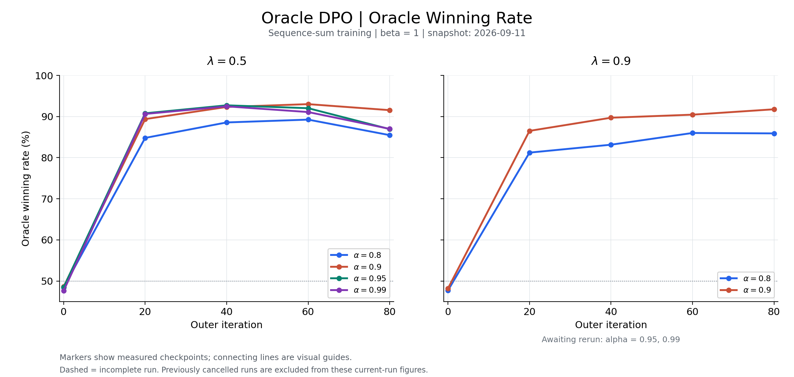
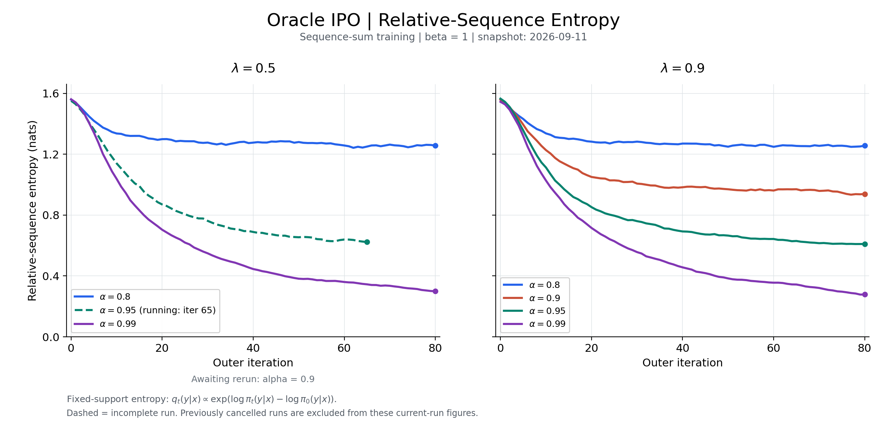

# Oracle1 sequence-sum results: historical snapshot 2026-09-11

Published on 2026-10-06 from the preserved local September 11 export.
Retrieval timestamp recorded in that export: 2026-09-11T19:57:40.424482+00:00.
No server jobs were queried, changed or submitted for this publication.

**This is not a completed all-16 grid or current queue report.** Of the
16 intended method/alpha/lambda cells, 12 have iterations 0..80 and WR80,
one has iterations 0..65, and three have no curves in this snapshot.
The historical `running` / `pending_rerun` labels in original tables and
figures are retained as September 11 observations, not current assertions
or authorization to resubmit anything.

## Coverage

All shown runs use sequence-sum training, beta=1, seed0, frozen reference
within each outer update, and alpha in {.8,.9,.95,.99}, lambda in {.5,.9}.
Oracle lambda is the initial-generator mixture probability, not the history
campaign's current-panel weight.

| Objective | Complete at 80 in snapshot | Partial | Not present |
|---|---|---|---|
| DPO | All four lambda=.5; alpha=.8/.9 at lambda=.9 | None | alpha=.95/.99, lambda=.9 |
| IPO | alpha=.8/.99 at lambda=.5; all four lambda=.9 | alpha=.95, lambda=.5 through 65 (last WR60) | alpha=.9, lambda=.5 |

Use `oracle_parameter_summary_20260911.csv` for the complete 16-cell table,
`oracle_curves_20260911.csv` for plotted values, and
`oracle_winning_rate_checkpoints_20260911.csv` for measured WR checkpoints.
The 26 per-run CSVs retain training metrics and reconstructed entropy
metrics for the 13 available runs. No raw prompt/response text is included.

## Metrics and interpretation

- Oracle1 is the frozen `nvidia/Llama-3.1-Nemotron-70B-Reward-HF` scalar judge.
- `oracle_win_rate` evaluates newly generated checkpoint responses against
  cached initial-policy responses on matching prompts. It averages all
  response pairs per prompt, then prompts. A win is strictly greater reward;
  ties count as zero in this historical metric, not half.
- `oracle_soft_win_rate` is separately stored where available and averages
  sigmoid reward differences. Do not relabel hard WR as soft WR.
- Main entropy is `prompt_relative_sequence_entropy_mean`, reconstructed
  over the recorded fixed support. Original reconstruction metadata are
  preserved. Old `prompt_entropy_mean` is a length-normalized legacy metric,
  not the plotted entropy. The reconstruction was not rerun from private raw
  dumps in this publication; copying/revalidating tables is not a fresh
  mathematical certification of reconstruction.
- WR uses the same judge as training and is not independent human quality
  evidence. A flat WR curve does not certify policy convergence.

## Figures

These original figures all say snapshot 2026-09-11. Missing runs are not
interpolated, and the partial IPO curve stops at its recorded horizon.

| Method | Relative-sequence entropy | Generated-response hard WR |
|---|---|---|
| DPO | [PNG](oracle_dpo_relative_sequence_entropy_20260911.png) / [PDF](oracle_dpo_relative_sequence_entropy_20260911.pdf) | [PNG](oracle_dpo_winning_rate_20260911.png) / [PDF](oracle_dpo_winning_rate_20260911.pdf) |
| IPO | [PNG](oracle_ipo_relative_sequence_entropy_20260911.png) / [PDF](oracle_ipo_relative_sequence_entropy_20260911.pdf) | [PNG](oracle_ipo_winning_rate_20260911.png) / [PDF](oracle_ipo_winning_rate_20260911.pdf) |




## Provenance and reproduction

`publication_manifest.json` lists exact copied files and SHA256 checksums.
The local `.gitattributes` preserves original CSV/plotter line endings so the
archived checksums remain valid on both Linux and Windows checkouts.
Only the reviewed numeric CSVs, original figures and portable plotting script
were copied. Raw scheduler logs, source directories, ZIPs, private generated
text and the original manifest's absolute machine paths were excluded.

The original September export does not record an exact training Git commit
for these older runs. This field is explicitly unknown in the publication
manifest. The publication commit must not be cited as the training commit.
Run names and the per-run filenames identify the archived sequencesum_v2
artifacts, but are not a substitute for full training-source provenance.

From this directory, with NumPy, Pandas and Matplotlib installed:

```sh
python validate_snapshot.py
python -m unittest test_snapshot
# Regenerate original figures/tables locally (does not train or contact SSH):
python plot_oracle_results.py
```

Validation checks hashes, available-run completeness, entropy/WR ranges,
frozen-reference flags, raw-vs-reconstructed WR and agreement of the published
aggregates with per-run files. The plotter is preserved unchanged and its
old scheduler-status labels must be read with this dated README.
